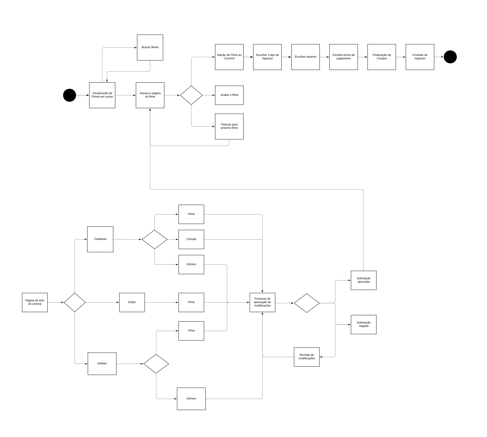

# CineFDS

Página no GitHub dedicada ao projeto de Fundamentos de Desenvolvimento de Software.

---

## Entregas

  
1ª Entrega

  
  - [Página no Jira](https://juliasales.atlassian.net/jira/software/projects/PCF/boards/2)
  - [Protótipo Lo-Fi](https://www.figma.com/file/Ms5aUXSnImGqW7S97h7m92/Wireframe-Template-(Community)?type=design&node-id=0%3A1&mode=design&t=v2NZ8sR463NZwdIk-1)
  - [Screencast](https://www.youtube.com/watch?v=KBGdFhLl5QU) *(Abrir com e-mail institucional)*
  - **Backlog:**  
    
  - **Quadro:**  
    

  
2ª Entrega

  
  - **Instruções de Uso:**
    - Instale os pacotes do `requirements.txt`
    - Execute: `python manage.py runserver`
    - Acesse `/admin/` para gerenciar o sistema
    - Crie um superusuário para realizar modificações
  - [Diagrama de Atividades](https://lucid.app/lucidchart/bb251b89-9408-4094-92cf-37d2f4fcab6e/edit?viewport_loc=-10415%2C-6050%2C12296%2C4880%2C0_0&invitationId=inv_963f026a-c0bd-4bdf-bbd2-693fe5ce399d)
  - **Diagrama:**  
    
  - **Bug Tracker:**  
    
  - **Sprint e Histórias Implementadas:**  
    
  - [Screencast 2ª Entrega](https://youtu.be/Rphdc2gDhM0)

  
3ª Entrega

  
  - [Deployment na Azure](https://cinefds.azurewebsites.net)
  - **Credenciais:**
    - **Login:** `adm123`
    - **Senha:** `admin123`
  - **Diagrama Atualizado:**  
    
  - **Sprint e Histórias Implementadas:**  
    
  - **Bug Tracker:**  
    
    
  - [Protótipo Lo-Fi](https://www.figma.com/file/Ms5aUXSnImGqW7S97h7m92/Wireframe-Template-(Community)?type=design&node-id=0%3A1&mode=design&t=v2NZ8sR463NZwdIk-1)
  - **Screencasts:**
    - [Azure](https://youtu.be/guMPy21XEss)
    - [Testes e CI/CD](https://youtu.be/RwNLcXC-mfY)
  - **Programação em Par:**
    - Relato disponível [aqui](https://docs.google.com/document/d/19zGnUU6alP4K4-cIQ1aMZvmV7GqcnomqHvNyMZZcX0Q/edit?usp=sharing)

  
4ª Entrega

  
  - [Slides Apresentação Final](https://www.canva.com/design/DAGGxFwmEOE/5HSkTcgglxai1-aF04BkgQ/edit?utm_content=DAGGxFwmEOE&utm_campaign=designshare&utm_medium=link2&utm_source=sharebutton)
  - [Protótipo Lo-Fi Atualizado](https://www.figma.com/file/Ms5aUXSnImGqW7S97h7m92/Wireframe-Template-(Community)?type=design&node-id=0%3A1&mode=design&t=v2NZ8sR463NZwdIk-1)
  - [Screencast Lo-Fi](https://www.youtube.com/watch?v=sNfzrNT9JnI)
  - **Screencasts:**
    - [Site](https://youtu.be/7zUDd9M8pe8)
    - [Testes e CI/CD](https://youtu.be/UoYZ18QsB14)
  - [Deployment na Azure](https://cinefds.azurewebsites.net)
  - **Página no Jira:**  
    
  - **Bug Tracker:**  
    
    
  - **Credenciais:**
    - **Admin:**
      - **Login:** `adm123`
      - **Senha:** `admin123`
    - **Usuário:**
      - **Login:** `123`
      - **Senha:** `123`
  - **Programação em Par:**
    - Relato disponível [aqui](https://docs.google.com/document/d/19zGnUU6alP4K4-cIQ1aMZvmV7GqcnomqHvNyMZZcX0Q/edit?usp=sharing)
  - **Diagrama da 4ª Entrega:**  
    
  - **Resumo da 4ª Entrega:**
    - Correção e refinamento das histórias implementadas
    - Funcionalidades para usuários e administradores

## 🤝 Colaboradores

<table>
  <tr>
    <td align="center">
      <a href="https://github.com/">
         
        
          <b></b>
        
      </a>
    </td>
    <td align="center">
      <a href="https://github.com/">
         
        
          <b></b>
        
      </a>
    </td>
    <td align="center">
      <a href="https://github.com/julsales" >
         
        
          <b>Júlia Sales</b>
        
      </a>
    </td>
    <td align="center">
      <a href="https://github.com/" >
         
        
          <b></b>
        
      </a>
    </td>
  </tr>
</table>

